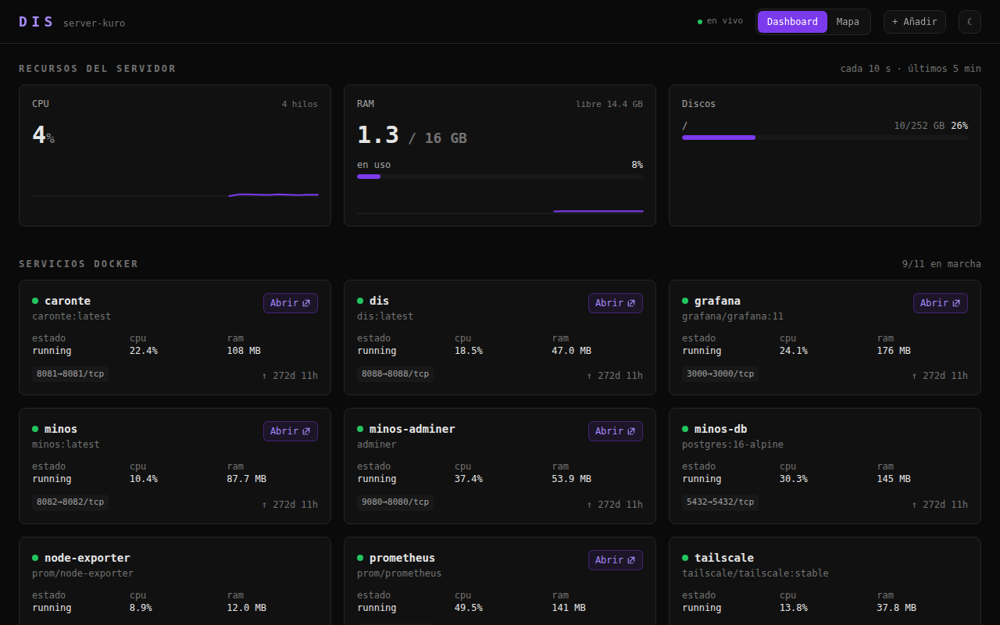
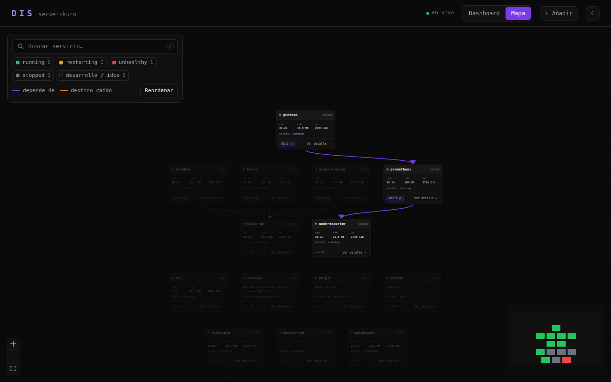
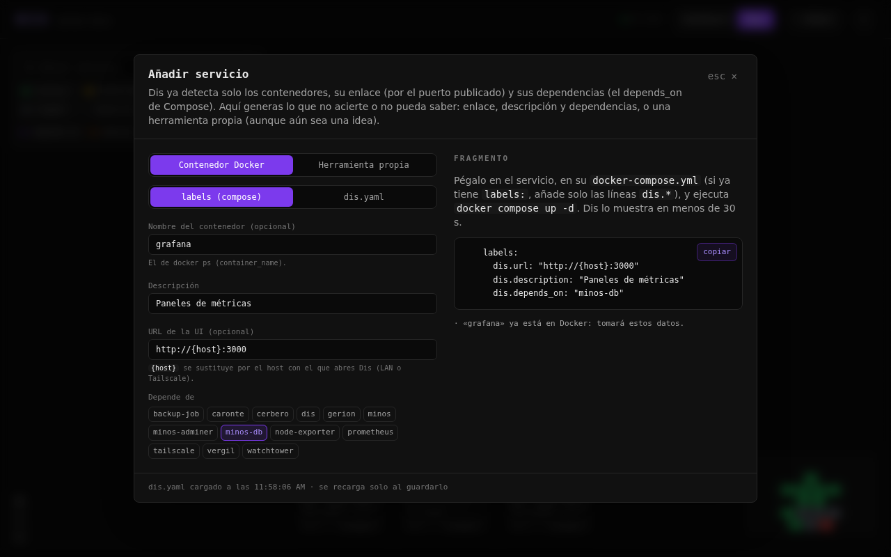

# Dis

Dashboard para un servidor casero con Docker: todos los contenedores, tus herramientas propias
y el estado de la máquina en una sola página, con acceso directo a cada servicio y un mapa de
cómo dependen unos de otros. Sustituye a Homepage en **server-kuro**.

> Dis es la ciudad amurallada que separa el Infierno superior del inferior; aquí es la puerta
> de entrada a todo lo que corre en el servidor.



- **Cero configuración para empezar.** Lee Docker y muestra todos los contenedores, con su
  enlace (por el puerto que publican) y sus dependencias (por el `depends_on` de Compose).
- **Dashboard**: CPU, RAM y discos del servidor con histórico de 5 min, una tarjeta por
  contenedor y por herramienta, y las alertas de Cerbero.
- **Mapa** de servicios: al pasar el ratón por uno se resaltan sus dependencias; buscador
  (`/`), filtros por estado y nodos que se pueden recolocar.
- **Panel de detalle**: métricas en vivo, puertos, variables de entorno (con las credenciales
  ocultas) y los últimos logs.
- **Botón «+ Añadir»** que genera la configuración de un servicio nuevo, y `dis.yaml` que se
  recarga solo al guardarlo.
- **Ligero y de solo lectura**: un contenedor de ~50 MB de RAM que nunca modifica Docker.



## Índice

- [Puesta en marcha](#puesta-en-marcha)
- [Qué detecta Dis solo](#qué-detecta-dis-solo)
- [Añadir un servicio](#añadir-un-servicio)
- [Configuración](#configuración)
- [Seguridad](#seguridad)
- [Solución de problemas](#solución-de-problemas)
- [Desarrollo](#desarrollo)
- [API](#api)

## Puesta en marcha

**Requisitos:** un Linux con Docker Engine y Docker Compose v2 (comprueba con
`docker compose version`). Nada más: la imagen compila el frontend y el backend.

```bash
git clone https://github.com/kur0h3i/Dis.git
cd Dis
cp .env.example .env        # opcional: puerto, host de los enlaces, discos...
docker compose up -d --build
```

Abre `http://IP-DEL-SERVIDOR:8088` (vale la IP de la LAN o el nombre de Tailscale). En menos
de un minuto el contenedor aparece como `healthy`:

```bash
docker compose ps           # STATUS: Up … (healthy)
curl http://localhost:8088/api/health   # {"status":"ok"}
```

Y ya está: todos tus contenedores aparecen solos. Lo siguiente, si quieres, es describir tus
[herramientas propias](#añadir-un-servicio) en `dis.yaml`.

**Actualizar:**

```bash
git pull && docker compose up -d --build
```

**Desinstalar:** `docker compose down` (y `docker image rm dis:latest` para borrar la imagen).
Dis no guarda datos: la única configuración es `dis.yaml` y, si lo creaste, `.env`.

## Qué detecta Dis solo

Dis parte de lo que ya sabe Docker y solo pide configuración para lo que no puede deducir. Lo
que declaras a mano siempre tiene prioridad sobre lo detectado.

| Qué | De dónde lo saca | Cómo corregirlo |
|---|---|---|
| Contenedores (también los parados), estado, salud, CPU, RAM, puertos y logs | API de Docker | — |
| Enlace a la UI | El primer puerto web publicado: ignora bases de datos, colas, SSH… y lo publicado solo en `127.0.0.1`; 443/8443/9443 van por `https` | Label `dis.url` (o `dis.url: ""` para quitar el enlace) |
| Descripción | Labels OCI de la imagen (`org.opencontainers.image.description` o `title`) | Label `dis.description` |
| Dependencias (aristas del mapa) | `depends_on` de Docker Compose, dentro de cada proyecto | Label `dis.depends_on` (se suma a las de Compose) |
| Herramienta ↔ contenedor | Un contenedor que se llama igual que el `id` de la herramienta | `container:` en la herramienta |
| Enlace de una herramienta | El de su contenedor | `url:` en la herramienta |

En el panel de detalle, lo deducido lleva una nota («enlace deducido del puerto publicado»,
«incluye el depends_on de Compose»). Para desactivar la autodetección, en `dis.yaml`:

```yaml
autodetect:
  urls: true          # false = sin enlaces automáticos
  descriptions: true
  dependencies: true
# o, para todo a la vez:  autodetect: false
```

## Añadir un servicio

Lo más fácil es el botón **+ Añadir** de la cabecera: rellenas nombre, URL, descripción y
dependencias, y te da el fragmento listo para copiar y pegar, ya validado.



Por debajo hay tres formas, según el caso:

**1. Un contenedor: labels en su `docker-compose.yml`.** Lo recomendable: el servicio se
describe a sí mismo y no hay que tocar Dis. Tras `docker compose up -d`, aparece en menos de
30 s.

```yaml
services:
  grafana:
    image: grafana/grafana
    ports: ["3000:3000"]
    labels:
      dis.url: "http://{host}:3000"          # opcional: se detecta por el puerto
      dis.description: "Paneles de métricas"
      dis.depends_on: "prometheus,minos-db"  # separadas por comas
```

**2. Un contenedor cuyo compose no quieres tocar: `containers:` en `dis.yaml`.**

```yaml
containers:
  minos-adminer:
    url: "http://{host}:9080"
    description: Adminer (UI web de la BD de Minos)
    depends_on: [minos-db]
```

**3. Una herramienta propia: `tools:` en `dis.yaml`.** Para tus proyectos, corran en Docker o
no, y también para los que aún están en desarrollo o son una idea.

```yaml
tools:
  - id: caronte
    name: Caronte
    description: Visualizador de BD
    stage: operational        # operational | development | idea
    url: "http://{host}:8081" # opcional si su contenedor publica el puerto
    container: caronte        # opcional si el contenedor se llama igual que el id
    depends_on: [minos-db]
```

`dis.yaml` **se recarga solo** al guardarlo, sin reiniciar Dis. Si queda con un error de
sintaxis, Dis sigue con la última versión buena y lo avisa en la cabecera (`⚠ dis.yaml`) con
el mensaje del error.

`{host}` en cualquier URL se sustituye por el host con el que abres Dis, así el mismo enlace
funciona por la LAN y por Tailscale.

## Configuración

### `dis.yaml`

Está en la raíz del repo, comentado, y el compose lo monta en el contenedor. Todas las claves
son opcionales:

```yaml
cerbero_url: null        # URL de la API de Cerbero; null = "Cerbero no conectado"
public_host: null        # host fijo para los enlaces {host}; null = el de la petición
disks: [/]               # puntos de montaje del host a mostrar en "Recursos"

autodetect:              # ver "Qué detecta Dis solo"
  urls: true
  descriptions: true
  dependencies: true

containers: {}           # metadatos por nombre de contenedor (url, description, depends_on)
tools: []                # herramientas propias (id, name, description, stage, url,
                         #   container, depends_on)
edges:                   # aristas sueltas entre dos nodos cualesquiera
  - { source: minos, target: caronte }
```

### Variables de entorno (`.env`)

Para los ajustes de despliegue, copia `.env.example` a `.env` junto a `docker-compose.yml`.
Tienen prioridad sobre `dis.yaml`:

| Variable | Por defecto | Para qué |
|---|---|---|
| `DIS_PORT` | `8088` | Puerto del host en el que se publica Dis |
| `DIS_PUBLIC_HOST` | — | Host fijo para los enlaces `{host}` (p. ej. el nombre de Tailscale) |
| `DIS_DISKS` | `/` | Discos del host a mostrar, separados por comas (`/,/home`) |
| `CERBERO_URL` | — | URL base de Cerbero (se consulta `GET {url}/api/alerts`) |

Avanzadas, ya fijadas en la imagen o en el compose: `DIS_CONFIG` (ruta al YAML),
`DIS_HOST_ROOT` (raíz del host montada, `/hostfs`), `DIS_STATIC_DIR` (frontend compilado) y
`DIS_LOG_LEVEL` (`INFO`).

### Qué monta el compose

| Volumen | Para qué |
|---|---|
| `/var/run/docker.sock:ro` | leer contenedores, stats y logs |
| `/:/hostfs:ro` | medir el uso de los discos del host |
| `./dis.yaml:/app/dis.yaml:ro` | la configuración, editable sin reconstruir la imagen |

CPU y RAM no necesitan `pid: host`: `/proc/stat` y `/proc/meminfo` ya muestran el host desde
dentro del contenedor. El compose limita Dis a 150 MB de RAM y media CPU; en reposo usa
~45 MB y ~55 MB con carga.

## Seguridad

- **Dis no tiene autenticación.** Está pensado para la LAN o una tailnet. No lo publiques a
  Internet sin un proxy inverso con autenticación delante.
- **El socket de Docker da control total.** El `:ro` protege el fichero, no la API: quien
  controle el proceso de Dis podría hablar con Docker con todos los permisos. Dis solo hace
  llamadas de lectura y no ofrece ninguna acción de escritura. Para blindarlo, pon un
  [docker-socket-proxy](https://github.com/Tecnativa/docker-socket-proxy) delante (a costa de
  un segundo contenedor).
- **Las credenciales no salen del servidor.** Las variables de entorno cuyo nombre contiene
  `PASSWORD`, `SECRET`, `KEY` o `TOKEN` se muestran como `***`.

## Solución de problemas

**La página no carga.** Mira `docker compose logs dis`. Si el puerto 8088 está ocupado,
cambia `DIS_PORT` en `.env` y vuelve a ejecutar `docker compose up -d`.

**Arriba pone «sin conexión con la API».** El navegador no llega al backend: comprueba que el
contenedor está `healthy` (`docker compose ps`).

**«Docker no disponible» o no aparece ningún contenedor.** Dis no puede leer el socket.
Comprueba que el volumen `/var/run/docker.sock` está en el compose. Con Docker *rootless*, el
socket está en `$XDG_RUNTIME_DIR/docker.sock`: cambia la parte izquierda del volumen.

**Los enlaces apuntan a un host que no es.** Por defecto usan el host con el que abres Dis.
Si pasas por un proxy o quieres un nombre fijo, pon `DIS_PUBLIC_HOST` en `.env`.

**Un contenedor no tiene enlace, o apunta al puerto equivocado.** La detección elige el
primer puerto web publicado. Fíjalo con el label `dis.url` o con `url:` en `dis.yaml`.

**He editado `dis.yaml` y no cambia nada.** Si en la cabecera aparece `⚠ dis.yaml`, el
fichero tiene un error (pasa el ratón por encima para verlo). Si no, puede que tu editor
guarde sustituyendo el fichero (vim, algunos IDE): el compose monta un único fichero y el
contenedor sigue viendo el antiguo. Ejecuta `docker compose restart dis`.

**Los discos salen vacíos o no aparecen.** Las rutas de `disks`/`DIS_DISKS` son del host (`/`,
`/home`…), y necesitan el volumen `/:/hostfs:ro`.

## Desarrollo

Requisitos: Python 3.12 y Node 20+. El socket de Docker es opcional: sin él,
`/api/containers` devuelve 503 y el resto funciona.

```bash
# Backend (puerto 8000)
cd backend
python3.12 -m venv .venv
.venv/bin/pip install -e '.[dev]'
.venv/bin/uvicorn app.main:app --reload --port 8000

# Frontend (puerto 5173, con proxy de /api al 8000)
cd frontend
npm install
npm run dev
```

La config se busca en `DIS_CONFIG`, luego en `./dis.yaml` y en `../dis.yaml`.

Antes de subir cambios:

```bash
cd backend && .venv/bin/ruff check . && .venv/bin/ruff format --check . && .venv/bin/pytest
cd frontend && npm run lint && npm run format:check && npm run build
```

### Estructura

```
Dis/
├── backend/                 FastAPI + Docker SDK + psutil (Python 3.12)
│   ├── app/
│   │   ├── main.py            rutas de la API y servido del frontend compilado
│   │   ├── config.py          dis.yaml (con recarga en caliente) y variables de entorno
│   │   ├── autodetect.py      enlaces, descripciones y dependencias deducidos de Docker
│   │   ├── docker_service.py  contenedores, stats y logs (solo lectura)
│   │   ├── ecosystem.py       herramientas y grafo de servicios
│   │   ├── host_service.py    CPU, RAM y discos, con histórico de 5 min en memoria
│   │   ├── cerbero.py         proxy de alertas de Cerbero
│   │   └── models.py          esquemas de las respuestas
│   └── tests/
├── frontend/                React 18 + Vite + TypeScript + Tailwind + React Flow
│   └── src/
│       ├── views/             DashboardView, MapView
│       ├── components/        ServiceNode, ServicePanel, AddServiceDialog…
│       ├── api/               tipos, cliente y hooks de react-query
│       └── lib/               formato, tema, layout y foco del grafo, fragmentos YAML
├── docs/                    capturas del README
├── dis.yaml                 configuración
├── .env.example             ajustes de despliegue
├── Dockerfile               imagen multi-etapa (frontend + API en un contenedor)
└── docker-compose.yml
```

## API

Todas son `GET` y devuelven JSON. `{id}` acepta el id o el nombre del contenedor.

| Ruta | Devuelve |
|---|---|
| `/api/containers` | `id, name, image, status, ports, uptime_s, cpu_pct, mem_mb, url, description, depends_on, detected` |
| `/api/containers/{id}` | lo anterior + `env` (enmascarado), `labels`, `command` |
| `/api/containers/{id}/stats` | `cpu_pct, mem_mb, mem_limit_mb, net_rx_b, net_tx_b` |
| `/api/containers/{id}/logs` | `{lines}`: las últimas 100 líneas |
| `/api/resources` | `cpu_pct, ram_used_gb, ram_total_gb, disks, history_5m` |
| `/api/tools` | herramientas con su `status` calculado |
| `/api/graph` | `{nodes, edges, docker_available}` |
| `/api/alerts` | proxy de Cerbero o `{connected: false}` |
| `/api/config` | `{path, loaded_at, error}`: estado de la última recarga de `dis.yaml` |
| `/api/health` | `{status: "ok"}` (healthcheck) |

Estados: `running` (verde), `stopped` (gris), `restarting`/`paused` (amarillo), `unhealthy`
(rojo). Las herramientas añaden `development` e `idea` (gris, borde discontinuo en el mapa).

## Hoja de ruta

- Acciones start/stop/restart (marcadas con `TODO` en `docker_service.py`, `main.py` y
  `ServicePanel.tsx`), que requieren autenticación primero.
- Autenticación de Dis.
- Cerbero en vivo (streaming de alertas) cuando exista su API.
- Health-check HTTP de las herramientas que no corren en Docker.
